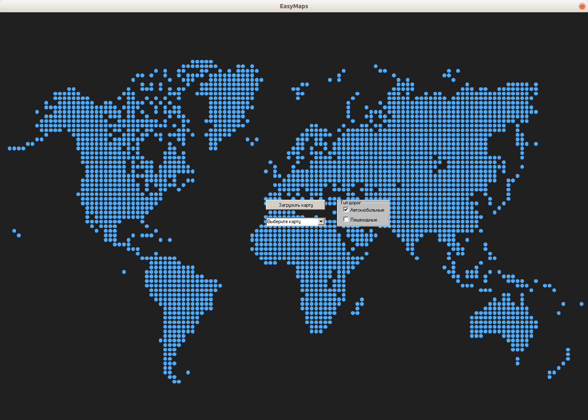
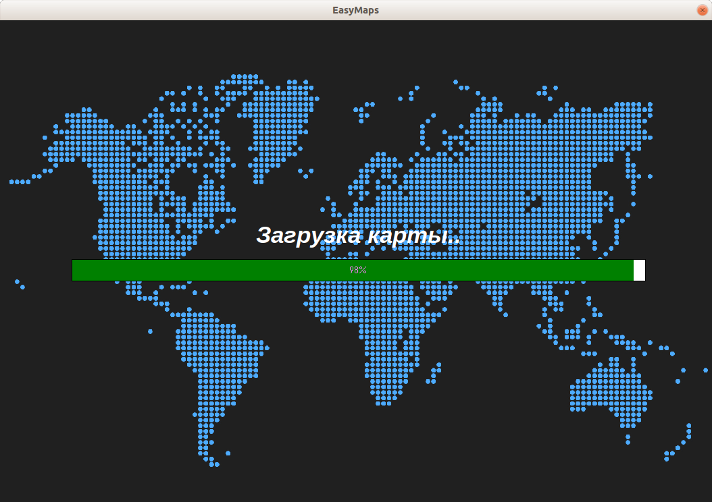
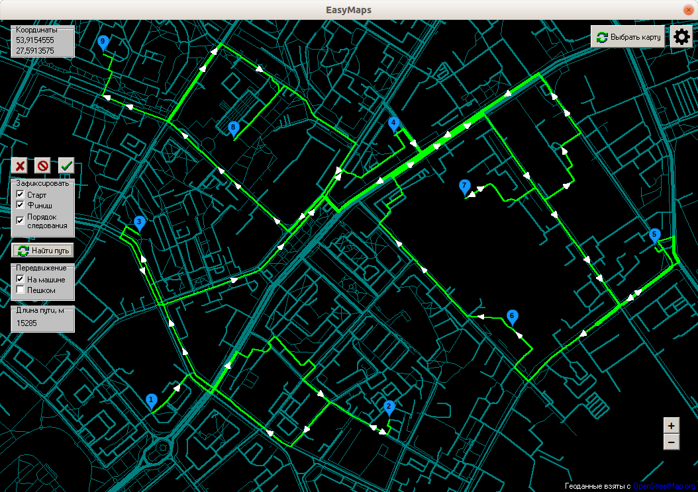
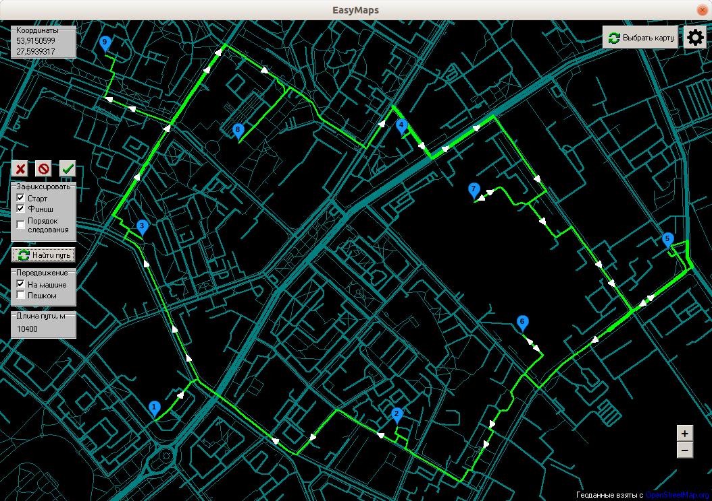
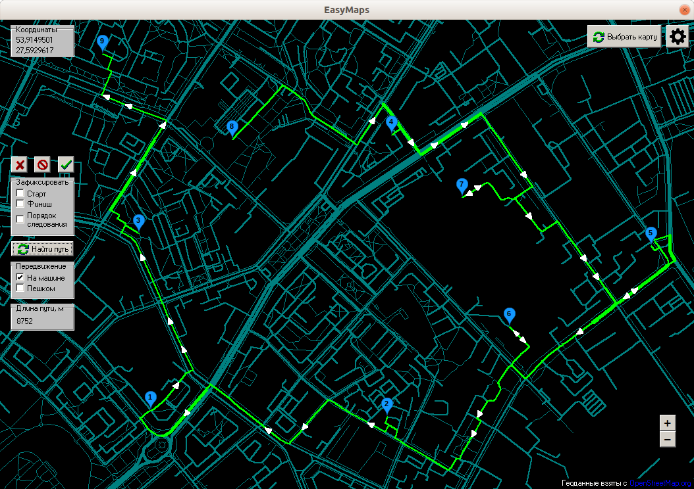
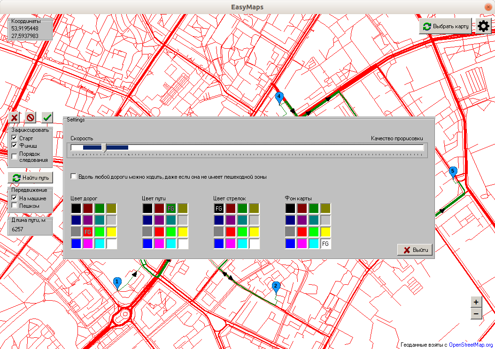
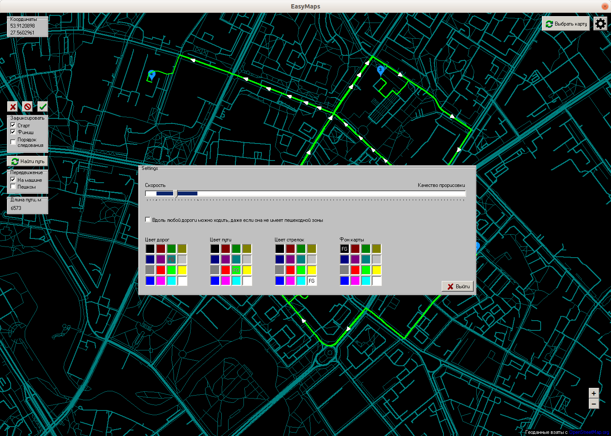
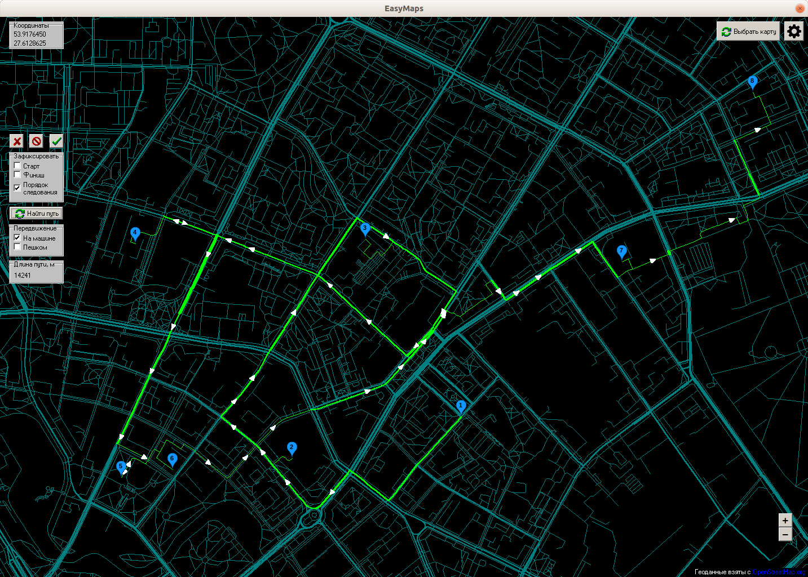
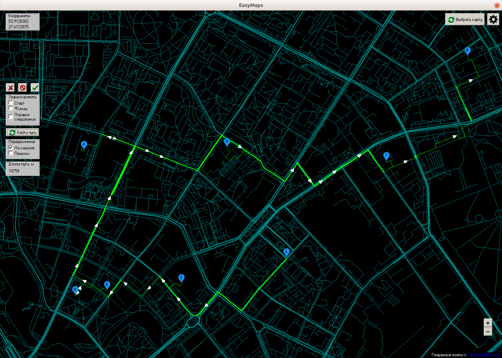

# EasyMaps

**Easy Maps** is an offline desktop application for Windows written in Delphi. It helps you to calculate the shortest
way between several(<= 25) points on a map and optimize points order. Maps are stored in text format. There are 
2 movement types: by foot and by car. The app allows you to choose start or end point or optimize it (useful for
couriers), set point order or optimize it.

*The app was run in [wine](http://www.winehq.org/) during the development period.*

##### Menu


##### Way with defined order

##### The same way with defined start and finish but optimized order

##### The same way with optimized order

##### Settings


##### Way with defined order

##### The same way with optimized order


#### Map format
Map with n nodes(vertices) and m roads(edges) format:
```
  vertices
  <vertex 1 id>
  <vertex 1 latitude>
  <vertex 1 longitude>
  <vertex 2 id>
  <vertex 2 latitude>
  <vertex 2 longitude>
  ...
  <vertex n id>
  <vertex n latitude>
  <vertex n longitude>

  edges
  <road 1 movement type>
  <road 1 width (lanes number)>
  <is road 1 two-way ('True' or 'False')>
  <vertex 1 id>
  <vertex 2 id>
  ...
  <vertex n1 id>

  <road 2 movement type>
  <road 2 width (lanes number)>
  <is road 2 two-way ('True' or 'False')>
  <vertex 1 id>
  <vertex 2 id>
  ...
  <vertex n2 id>

  ...
  <road m movement type>
  <road m width (lanes number)>
  <is road m two-way ('True' or 'False')>
  <vertex 1 id>
  <vertex 2 id>
  ...
  <vertex nm id>
```

## Run
Just run EasyMaps.exe file.

## Build
To build the application you need to install Delphi programming language compiler and build the project.
